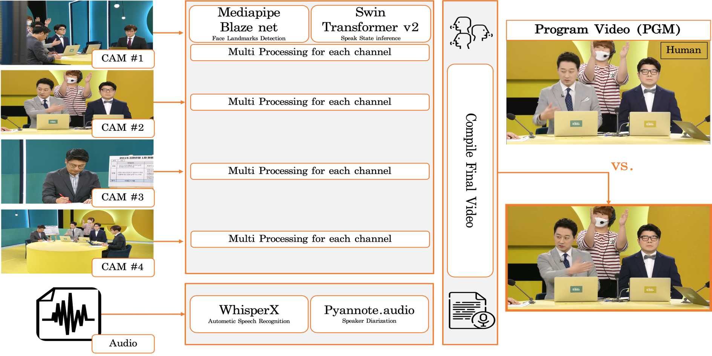
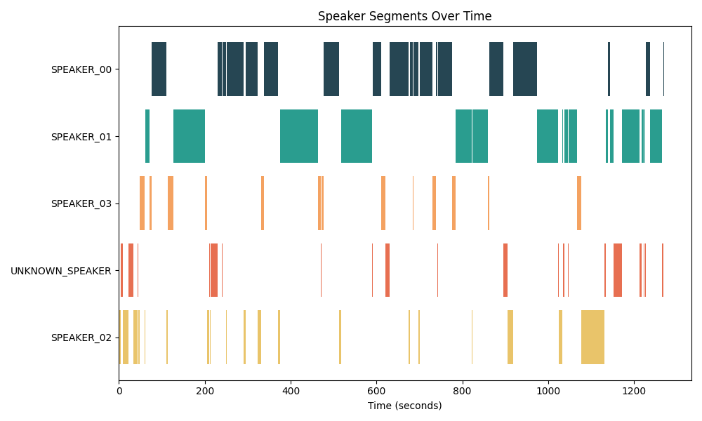
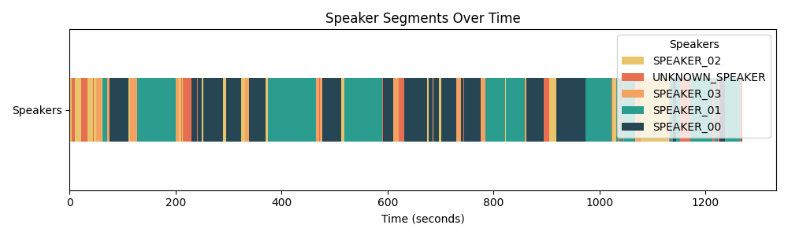

# Multi-Channel Video Compilation

This is the multi-channel video compile solution.
Compile multiple video files into a single video file with multiple channels.
This solution is implemented referring to the whisperx and pyannote-audio speech recognition and speaker diarization solutions.


# Installation
```
conda install pytorch torchvision torchaudio pytorch-cuda=12.1 -c pytorch -c nvidia
# OR
pip install -r requirements.txt
```

libcudnn8 is required to run the solution. 

pyanoote.audio == 3.3.1 is required to run the solution.

# Directory Structure
```
|-- ./
    |-- README.md
    |-- requirements.txt
    |-- run_inference_compilation.sh
    |-- trans_diar_whisperx_pyan.py
    |-- multi_channel_face_infer.py
    |-- face_utils.py
    |-- compile_final_video.py
    |-- outputs/
        |-- speaker_segments.png
        |-- speaker_segments2.png
        |-- transcriptions.json
        |-- sample_with_audio.mp4
        |-- multi_channel_face_infer.json
        |-- diarizations.json
        |-- sample.mp4
    |-- materials/
        |   # The following files are not included in the repository
        |   
        |-- pytorch_model.bin
        |-- speaking_detection_model_weight.pth
        |
        |-- your_audio
        |-- your_wide_video
        |-- your_speaker_ch_1_video
        |-- your_speaker_ch_2_video
        |-- your_speaker_ch_3_video
        |-- ...
```

You can download pytorch_model.bin from https://huggingface.co/pyannote/segmentation/tree/main

You can download speaking_detection_model_weight.pth from [here](https://drive.google.com/file/d/1dia_na1ci_B1fDfPX5fpJBbofDUvBF1L/view?usp=drive_link).

# Visualize the result

The following images are the visualization of the speaker diarization result.



