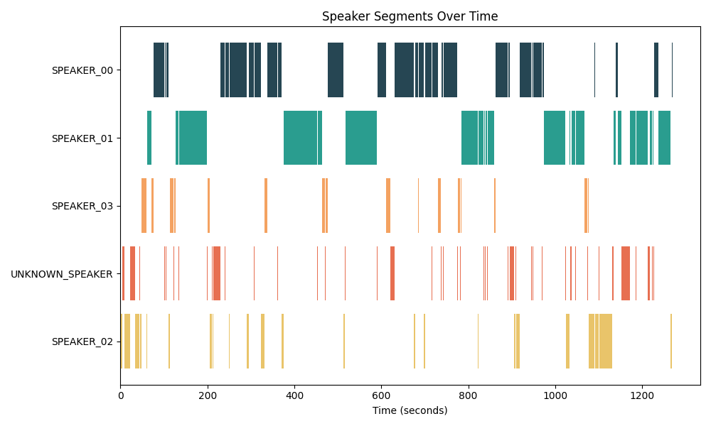
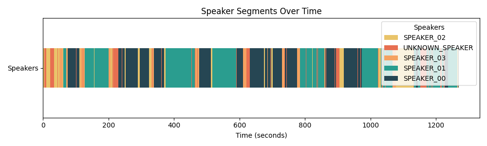

# multi-channel-video-compile

This is the multi-channel video compile solution.
Compile multiple video files into a single video file with multiple channels.
This solution is implemented referring to the whisperx and pyannote-audio speech recognition and speaker diarization solutions.

# Installation
pytorch
```
conda install pytorch torchvision torchaudio pytorch-cuda=12.1 -c pytorch -c nvidia
```

libcudnn8 is required to run the solution. 

pyanoote.audio == 3.3.1 is required to run the solution.


# Visualize the result

The following images are the visualization of the speaker diarization result.



