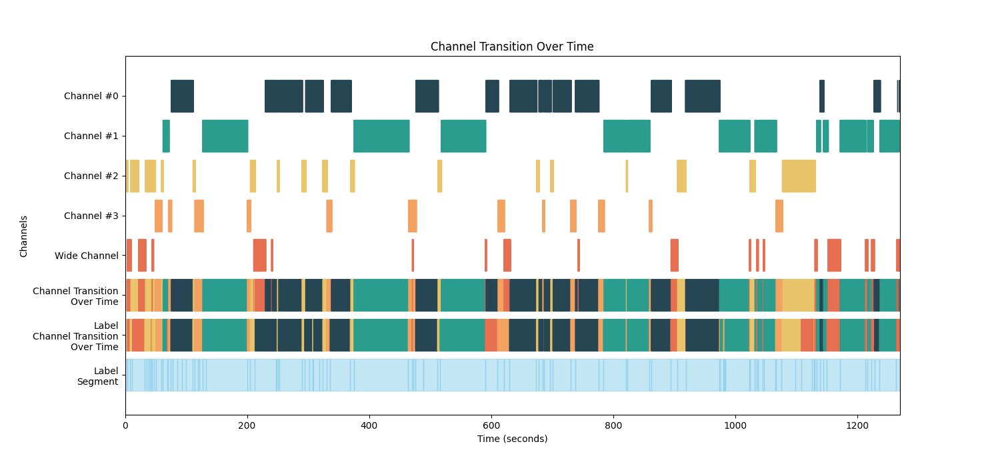

# Multi-Channel Video Compilation

This is the multi-channel video compile solution.
Compile multiple video files into a single video file with multiple channels.
This solution is implemented referring to the whisperx and pyannote-audio speech recognition and speaker diarization solutions.


# Installation
```
conda install pytorch torchvision torchaudio pytorch-cuda=12.1 -c pytorch -c nvidia
# OR
pip install -r requirements.txt
```

libcudnn8 is required to run the solution. 

pyanoote.audio == 3.3.1 is required to run the solution.

# Directory Structure
To run this solution, you need to match the directory structure below.
```
|-- ./
    |-- README.md
    |-- requirements.txt
    |-- run_inference_compilation.sh
    |-- trans_diar_whisperx_pyan.py
    |-- multi_channel_face_infer.py
    |-- face_utils.py
    |-- compile_final_video.py
    |-- outputs/
        |-- speaker_segments.png
        |-- speaker_segments2.png
        |-- transcriptions.json
        |-- sample_with_audio.mp4
        |-- multi_channel_face_infer.json
        |-- diarizations.json
        |-- sample.mp4
    |-- materials/
        |   # The following files are not included in the repository
        |   
        |-- pytorch_model.bin
        |-- speech_state_estimation_model.pth
        |
        |-- your_audio
        |-- your_wide_video
        |-- your_speaker_ch_1_video
        |-- your_speaker_ch_2_video
        |-- your_speaker_ch_3_video
        |-- ...
```
You can download pytorch_model.bin from https://huggingface.co/pyannote/segmentation/tree/main

You can download speaking_detection_model_weight.pth from [here](https://drive.google.com/file/d/1dia_na1ci_B1fDfPX5fpJBbofDUvBF1L/view?usp=drive_link).

# How to run
Argument Descriptions
- audio_path: Path to the input audio file.
- wide_ch_video: Path to the wide-channel (full-view) video file.
- speaker_ch_videos_for_inference: Paths to each speaker's video channels (used for inference).
- speaker_ch_videos_for_compilation: Paths to each speaker's video channels (used for final video compilation).
- num_speakers: Number of speakers (used in audio diarization).
- start_time: Start time (in seconds) used during video compilation.
- end_time: End time (in seconds) used during video compilation.
- diarization_model: Path to the pre-trained model for audio diarization.
- face_inference_model: Path to the model used for speach state estimation.
- save_path: Directory where intermediate results and the final output will be saved.

```
./script.sh audio_path wide_ch_video speaker_ch_videos_for_inference speaker_ch_videos_for_compilation num_speakers start_time end_time diarization_model face_inference_model save_path
```
```
python trans_diar_whisperx_pyan.py --audio_path [audio file path] --num_speakers [number of speakers] --diarization_model [model path] --save_path [output directory]
```
```
python multi_channel_face_infer.py --wide_ch_video [wide-channel video path] --speaker_ch_videos [speaker video paths] --face_inference_model [model path] --save_path [output directory]
```
```
python compile_final_video.py --wide_ch_video [wide-channel video path] --speaker_ch_videos [speaker video paths] --audio_path [audio file path] --start_time [start time] --end_time [end time] --transcript_path [transcription file path] --channel_inference_file [inference result file path] --save_path [output directory]
```

# Visualize the result

The following images are the visualization of the speaker diarization result.

<!--  -->

